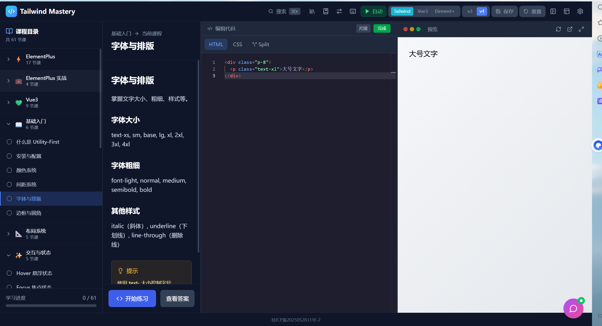

# Tailwind Mastery

一个交互式的 Tailwind CSS/Vue3/ElementPlus 学习平台。

**在线访问**: https://1093148685.github.io/tailwind-mastery-v2/



## 功能特性

- **多框架支持**: Tailwind CSS (v3/v4)、Vue3、ElementPlus
- **实时预览**: 代码编辑即可看到效果
- **课程体系**: 完整的模块化课程学习路径
- **代码编辑器**: 基于 Monaco Editor 的专业代码编辑体验
- **代码片段库**: 常用代码片段快速插入
- **速查表**: Tailwind CSS 常用类名速查
- **CSS 转换器**: CSS 与 Tailwind 类名相互转换
- **键盘快捷键**: 高效键盘操作支持
- **AI 助手**: 内置 AI 聊天助手
- **学习进度**: 本地保存学习进度

## 技术栈

- React 18 + TypeScript
- Vite
- Tailwind CSS
- Monaco Editor
- Radix UI
- Lucide React

## 快速开始

```bash
# 安装依赖
pnpm install

# 开发模式运行
pnpm dev

# 构建生产版本
pnpm build
```

## 项目结构

```
src/
├── components/     # React 组件
│   ├── ai/          # AI 相关组件
│   └── ...          # 其他组件
├── data/           # 课程数据
├── hooks/          # 自定义 Hooks
├── lib/            # 工具函数
└── types/          # TypeScript 类型定义
```

## License

MIT
